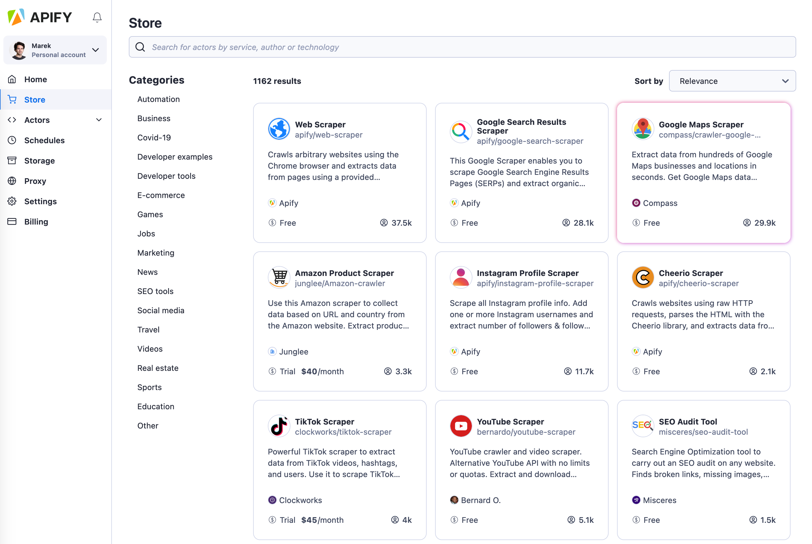
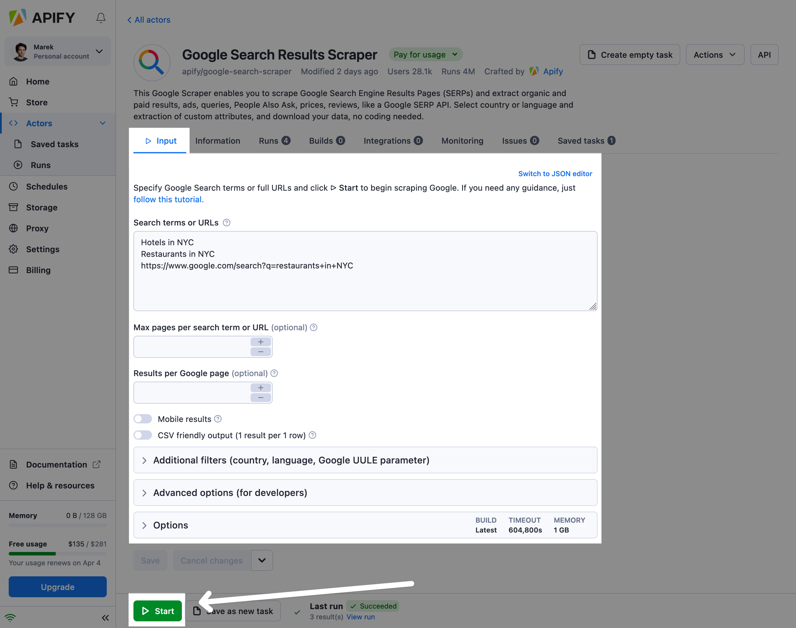
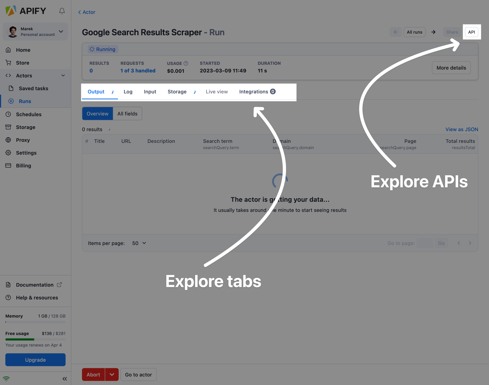

import Tabs from '@theme/Tabs';
import TabItem from '@theme/TabItem';

# Running

**In this section, you learn how to run Apify Actors using Apify Console or programmatically. You will learn about their configuration, versioning, data retention, usage, and pricing.**

---

## Run your first Apify Actor

If you have not [built](./development) your own actor yet, then choose one from the [Apify Store](https://apify.com/store). Once you have an actor chosen, you can start it in a number of ways.

> **You will need an Apify account to complete this tutorial. If you don't have one, [complete the sign-up process](https://console.apify.com/sign-up) first. Don't worry about the price - it's free.**

### 1. Choose your actor

After you sign-in to Apify Console, navigate to the [Apify Store](https://console.apify.com/store). We'll pick the [Google Search Results Scraper](https://console.apify.com/actors/nFJndFXA5zjCTuudP#/information/latest/readme):



### 2. Configure it

On the actor's page, head over to the **Input** tab. Don't be put off by all the boxes - the actor is pre-configured to run without any extra input. Just click the **Start** button in the bottom-left corner.

Alternatively, you can play around with the settings to make the results more interesting for you.




### 3. Wait for the results

Now the actor is running, and it will need a short time to gather the first results. Meanwhile, you can look around:
- There are more tabs providing you with the info about the actor run. For example, you can see the log and its storages
- At the top right, you can click on the API button to explore the related API endpoints



### 4. Get the results

Shortly you will see the first results popping up:


And you can use the export button at the bottom left to export the data in multiple formats:


And that's it! Now you can get back to the Actor's input, play with it, and try out more of the [Apify Actors](https://apify.com/store) or [build your own](./development).

## Running via Apify API

Actors can also be invoked using the Apify API by sending an HTTP POST request to the [Run actor](/api/v2/#/reference/actors/run-collection/run-actor) endpoint, such as:

```text
https://api.apify.com/v2/acts/apify~hello-world/runs?token=<YOUR_API_TOKEN>
```

An actor's input and its content type can be passed as a payload of the POST request, and additional options can be specified using URL query parameters. For more details, see the [Run actor](/api/v2/#/reference/actors/run-collection/run-actor) section in the API reference.

> To learn more about this, read the [Run an actor or task and retrieve data via API](../tutorials/run-actor-and-retrieve-data-via-api) tutorial.

## Running programmatically

Actors can also be invoked programmatically from other actors and your Python or JavaScript code:

- JavaScript: using the [`call()`](/sdk/js/reference/class/Actor#call) function of [`Actor`](/sdk/js/reference/class/Actor) class provided by the [`apify`](/sdk/js/) NPM package.
- Python: using the [`call()`](/api/client/python/reference/class/ActorClient#call) function provided by the [`apify-client`](/api/client/python) Python package.

<Tabs groupId="main">

<TabItem value="NodeJS" label="NodeJS">

```javascript
import { Actor } from 'apify';

await Actor.init();
// ...
const run = await Actor.call('apify/hello-world', {
    message: 'Hello!',
});
console.dir(run.output);
// ...
await Actor.exit();

```

</TabItem>


<TabItem value="Python" label="Python">

```python

run = apify_client.actor('apify/hello-world').call(run_input={ 'message': 'Hello!' })
print(run['id'])


```

</TabItem>

</Tabs>

The newly started actor runs under the same user account as the initial actor, and therefore all resources consumed are charged to the same user account. This allows more complex actors to be built using simpler actors built and owned by other users.

Internally, the `call()` function takes the user's API token from the `APIFY_TOKEN` environment variable, then it invokes the [Run actor](/api/v2/#/reference/actors/run-collection/run-actor) API endpoint, waits for the actor to finish and reads its output using the [Get record](/api/v2/#/reference/key-value-stores/record/get-record) API endpoint.


