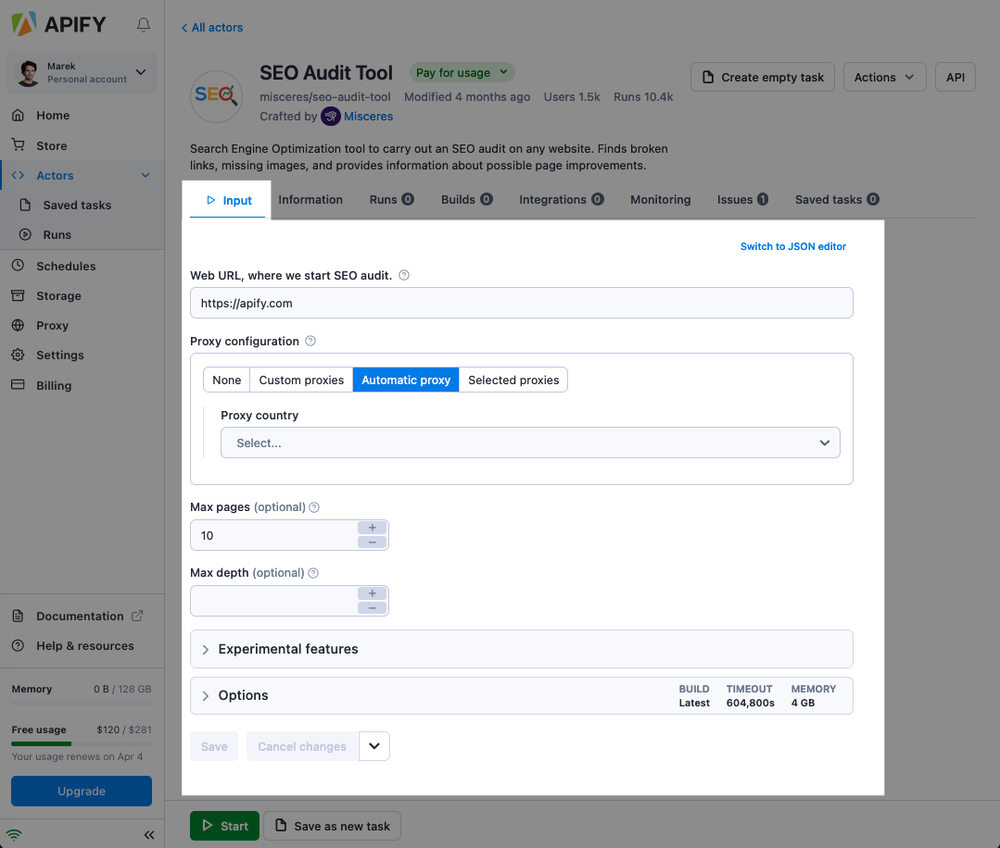
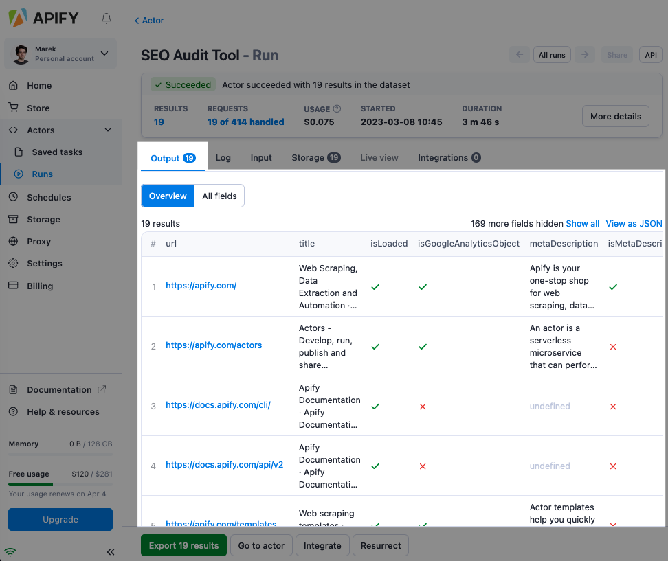
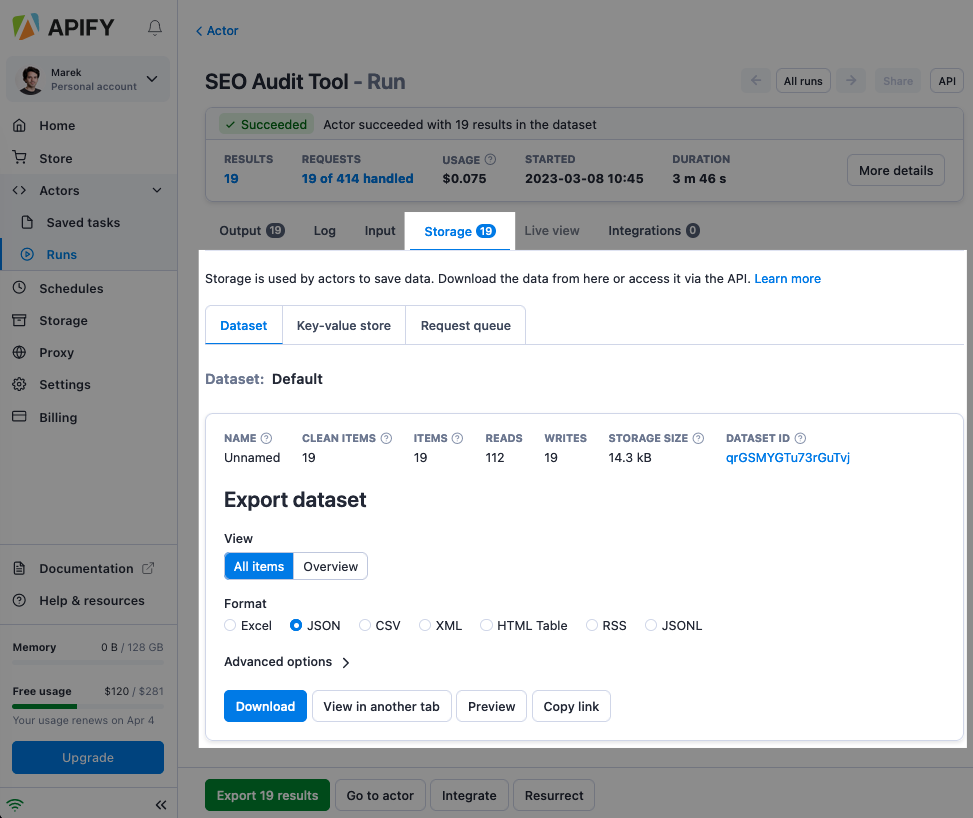

**Configure your actor's input parameters using the Apify Console, locally or via API. Access parameters in key-value stores from your actor's code.**

---

## Input

Each actor accepts input, which tells it what it should do. When running actor using the [Apify Console](https://console.apify.com) UI then, you can configure input using the autogenerated UI:



When running actor using the [API](https://docs.apify.com/api/v2) you can pass the same input as the JSON object. In this case, the corresponding JSON input looks as follows:

```json
{
    "maxRequestsPerCrawl": 10,
    "proxy": {
        "useApifyProxy": true
    },
    "startUrl": "https://apify.com"
}
```

## Output

While the input object provides a way to instruct actors, the actors can also generate an output, usually stored in its default [dataset](../../storage/dataset), but some additional files might be stored in its [key-value store](../../storage/key-value-store). Always read the actor's README to learn more about its output.

> For more details about storages, visit the [storage](../../storage/index.md) section.

You can quickly access the actor's output from the run detail page:



And to access all the data associated with the run, see the **storage** tab where you can explore the actor's default [dataset](../../storage/dataset),[key-value store](../../storage/key-value-store), and [request queue](../../storage/request-queue):



> You can also use [API](https://docs.apify.com/api/v2) to retrieve the output. To learn more about this, read the [Run an actor or task and retrieve data via API](../../tutorials/run-actor-and-retrieve-data-via-api) tutorial.

